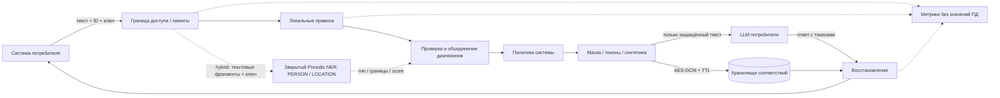

# СЕЙФ: данные остаются у владельца, смысл доходит до модели

СЕЙФ — локальный шлюз перед LLM и после её ответа: потребитель выбирает модель и передаёт ей результат защиты. Основной API и правила работают на Python 3.14t; необязательный закрытый NER-сервис на Python 3.13 добавляет PERSON/LOCATION-кандидатов из Presidio. Географический LOCATION не заменяет полный личный ADDRESS или CITY. Рабочая цепочка — [`client_example.py`](../scripts/client_example.py); [сравнение профилей](presidio.md).

## Почему это работает

1. **Локальное распознавание.** Форматы, контекст, словари и контрольные суммы выделяют Unicode-диапазоны; hybrid добавляет проверенные кандидаты модели. Пересечения разрешаются с приоритетом структурированных полей. Размеры сообщений, параллелизм и deadline NER ограничены; отказ включённого NER завершает защиту ошибкой, без скрытого перехода к результату только правил.
2. **Решение объяснимо.** Для каждой сущности API возвращает тип, диапазон и причину. Confidence — эвристический вес правила, не калиброванная вероятность. Сами значения не нужны технической телеметрии.
3. **Идентичность без раскрытия.** Один и тот же исходный фрагмент внутри запроса получает тот же случайный типизированный токен. Модель может повторять и переставлять токены; восстановление выполняется одним проходом и только по карте этого tenant/payload_id.
4. **Обратимость без копии исходного документа.** Хранятся защищённый текст и только заменённые участки; весь объект зашифрован AES-256-GCM. Отдельные fingerprints — HMAC-SHA256, а не словарно атакуемые открытые хеши email/телефона.
5. **Устойчивость к ретраям.** Для существующего ID сравниваются fingerprints оригинала и маски. Направление не переключается счётчиком запросов. Redis SET NX атомарно выбирает одну карту, поэтому несколько работников не перезаписывают соответствия.

## Режимы

| Режим | Что видит модель | Восстановление |
|---|---|---|
| `mask` | Звёздочки на местах букв и цифр; исходные пробелы и пунктуация | Точное совпадение с сохранённым защищённым текстом |
| `token` | `⟦PD:PERSON:случайный_ID⟧`; тип и повторы сущности сохранены | Точная маска или ответ LLM с известными токенами |
| `synthetic` | Макетные имена, `example.invalid`, заведомо невалидные реквизиты | Точное совпадение с сохранённым защищённым текстом |

Маски и синтетические значения не следует произвольно редактировать до восстановления: без отдельных токенов нельзя однозначно сопоставить одинаковые замены. Для свободного ответа LLM предназначен режим `token`. Неизвестные токены не раскрываются; они приводят к контролируемой ошибке.

## Масштабирование

**RAM** — один процесс и потеря соответствий при его перезапуске. **Базовый Compose** — общий Redis без дисковой персистентности: несколько API-workers согласованы, но перезапуск Redis теряет записи. **Sentinel/Kubernetes** — три Redis, три Sentinel, PVC/AOF и обнаружение нового primary; асинхронная репликация допускает потерю последних записей при аварии, zero-loss не гарантируется. `noeviction` предотвращает молчаливое вытеснение при нехватке памяти. Все API-экземпляры используют одинаковые мастер-ключ и политики; отказ хранилища даёт ошибку вместо несогласованного локального fallback. [Runbook и ограничения](kubernetes.md).

API-процессы и NER-workers масштабируются независимо: добавление API-реплик не ускоряет модель. Один NER-worker исполняет один расчёт и держит ограниченную очередь; модели загружаются до readiness. `scripts/serve.py` агрегирует метрики API-workers своего supervisor, а разные контейнеры опрашиваются отдельно. Rate limiting с Redis общий, `max_inflight` и CPU-пул локальные. Для SLA нужны измерения выбранного профиля, длины текстов и конфигурации; успешный короткий запрос не подтверждает такую же задержку документа на 100 000 токенов.

## Наблюдаемость

`seif_http_requests_total` и `seif_http_duration_seconds` дают RPS, ошибки и распределение задержек; `seif_stage_duration_seconds` — этапы vault/detect/ner/transform; `seif_entities_total` — выявленные типы. `seif_input_tokens_estimated_total` явно оценивает tokens как characters/4; это не точный счётчик токенизатора LLM. Точный TPS выбранной модели нужно считать в Core-компоненте или подключить локальный токенизатор этой модели. Пример PromQL: `rate(seif_http_requests_total[1m])`, `histogram_quantile(0.95, sum by(le)(rate(seif_http_duration_seconds_bucket[5m])))`.

## Источники технических решений

- [FastAPI: deployment и workers](https://fastapi.tiangolo.com/deployment/server-workers/)
- [Redis: SET NX / EX](https://redis.io/docs/latest/commands/set/)
- [Cryptography: AES-GCM, nonce и associated data](https://cryptography.io/en/latest/hazmat/primitives/aead/)
- [Cloudflare: ограничения Quick Tunnels](https://developers.cloudflare.com/cloudflare-one/networks/connectors/cloudflare-tunnel/do-more-with-tunnels/trycloudflare/)
