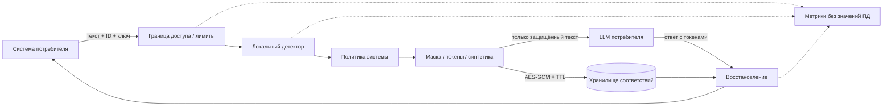

# СЕЙФ: данные остаются у владельца, смысл доходит до модели

СЕЙФ — самостоятельный локальный шлюз обработки текста. Он встраивается перед вызовом LLM и после ответа: потребитель сам выбирает модель, а передаёт ей только результат защиты. Рабочий пример цепочки — `scripts/client_example.py`.

## Почему это работает

1. **Распознавание без внешней модели.** Форматы, контекст поля, словари имён и контрольные суммы выделяют диапазоны Unicode. Конфликтующие диапазоны разрешаются по приоритету типа и длине, чтобы паспорт не превратился в телефон, а дата рождения — в произвольную дату.
2. **Решение объяснимо.** Для каждой сущности API возвращает тип, диапазон и причину. Confidence — эвристический вес правила, не калиброванная вероятность. Сами значения не нужны технической телеметрии.
3. **Идентичность без раскрытия.** Один и тот же исходный фрагмент внутри запроса получает тот же случайный типизированный токен. Модель может повторять и переставлять токены; восстановление выполняется одним проходом и только по карте этого tenant/payload_id.
4. **Обратимость без копии исходного документа.** Хранятся защищённый текст и только заменённые участки; весь объект зашифрован AES-256-GCM. Отдельные fingerprints — HMAC-SHA256, а не словарно атакуемые открытые хеши email/телефона.
5. **Устойчивость к ретраям.** Для существующего ID сравниваются fingerprints оригинала и маски. Направление не переключается счётчиком запросов. Redis SET NX атомарно выбирает одну карту, поэтому несколько работников не перезаписывают соответствия.

## Режимы

| Режим | Что видит модель | Восстановление |
|---|---|---|
| `mask` | Звёздочки на местах букв и цифр; исходные пробелы и пунктуация | Точное совпадение с сохранённым защищённым текстом |
| `token` | `⟦PD:PERSON:случайный_ID⟧`; тип и повторы сущности сохранены | Точная маска или ответ LLM с известными токенами |
| `synthetic` | Макетные имена, `example.invalid`, заведомо невалидные реквизиты | Точное совпадение с сохранённым защищённым текстом |

Маски и синтетические значения не следует произвольно редактировать до восстановления: без отдельных токенов нельзя однозначно сопоставить одинаковые замены. Для свободного ответа LLM предназначен режим `token`. Неизвестные токены не раскрываются; они приводят к контролируемой ошибке.

## Масштабирование

Один процесс с RAM-хранилищем — автономная демонстрация. Несколько процессов или реплик требуют общего Redis и одного ключа шифрования; потеря Redis приводит к 503, а не к отправке необработанного текста. В Docker Compose Redis доступен только во внутренней сети, не сохраняет данные на диск и использует `noeviction`: при нехватке памяти существующие соответствия не выбрасываются молча.

Штатный launcher `scripts/serve.py` запускает workers с общим каталогом multiprocess Prometheus, созданным до импорта метрик: `/metrics` суммирует все workers этого supervisor. Для нескольких контейнеров нужен раздельный scrape каждой реплики и суммирование в Prometheus. Rate limiting с Redis общий для реплик, а `max_inflight` локальный. Расширение числа workers само по себе не подтверждает SLA: требуется прогон на реальном железе и распределении длин документов.

## Наблюдаемость

`seif_http_requests_total` и `seif_http_duration_seconds` дают RPS, ошибки и распределение задержек; `seif_stage_duration_seconds` — этапы vault/detect/transform; `seif_entities_total` — выявленные типы. `seif_input_tokens_estimated_total` явно оценивает tokens как characters/4; это не точный счётчик токенизатора LLM. Точный TPS выбранной модели нужно считать в Core-компоненте или подключить локальный токенизатор этой модели. Пример PromQL: `rate(seif_http_requests_total[1m])`, `histogram_quantile(0.95, sum by(le)(rate(seif_http_duration_seconds_bucket[5m])))`.

## Источники технических решений

- [FastAPI: deployment и workers](https://fastapi.tiangolo.com/deployment/server-workers/)
- [Redis: SET NX / EX](https://redis.io/docs/latest/commands/set/)
- [Cryptography: AES-GCM, nonce и associated data](https://cryptography.io/en/latest/hazmat/primitives/aead/)
- [Cloudflare: ограничения Quick Tunnels](https://developers.cloudflare.com/cloudflare-one/networks/connectors/cloudflare-tunnel/do-more-with-tunnels/trycloudflare/)
