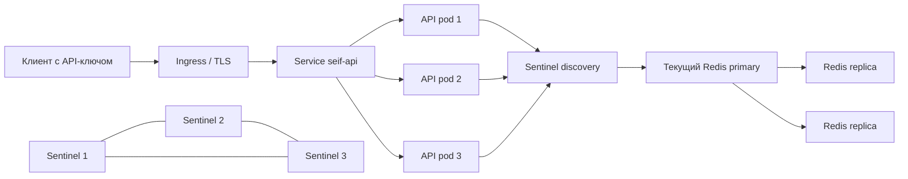

# Kubernetes: реплики API и Redis Sentinel

Подготовлен Kustomize-комплект в `deploy/k8s`: три реплики API, три Redis-пода с Sentinel, постоянные тома и автоматический выбор нового primary. **Наличие YAML и успешный рендер не означают, что кластер развёрнут.** В среде подготовки не было доступного Kubernetes-контекста; фактический failover и HPA нужно принять на целевом кластере по процедуре ниже.

Образ приложения в манифесте — `ghcr.io/l0ckr/seif-pii:1.0.0`. Его сборка, запуск и публикация в GHCR прошли в [GitHub Actions run 35700204670](https://github.com/L0ckR/seif-pii/actions/runs/35700204670), для коммита `f2fcf6d`. Это подтверждает публикацию артефакта, но не развёртывание Kubernetes. До применения обеспечьте кластеру доступ к приватному registry или загрузите образ на локальные узлы.



Sentinel-процесс находится в каждом Redis-поде. Каждый такой под получает собственный PVC; приложение обращается к выбранному primary через Sentinel, а не к случайной реплике за балансирующим Redis Service. `redis-headless` нужен для устойчивых адресов участников и discovery.

## Состав и принятые ограничения

| Ресурс | Настройка |
|---|---|
| Namespace | `seif`, Pod Security `restricted` |
| API Deployment | Начально 3 реплики, 1 Uvicorn worker и 2 CPU-потока на под, `SEIF_DEMO=0` |
| API HPA | 2–8 подов, CPU 65% от request; уменьшение с окном стабилизации 300 секунд |
| API rollout / PDB | `maxUnavailable: 0`, `maxSurge: 1`; PDB допускает недоступность одного пода |
| Redis StatefulSet | 3 пода, `podManagementPolicy: Parallel`, образ `redis:7.4-alpine` |
| Sentinel | 3 экземпляра, master name `seif-master`, quorum 2 |
| Хранение | PVC по 5 GiB, AOF `everysec`, `maxmemory 1gb`, `noeviction` |
| Репликация | `min-replicas-to-write=1`, допустимый lag 5 секунд; реплики read-only |
| Redis PDB | Минимум 2 доступных пода при добровольном выселении |
| Размещение | Base предпочитает разные узлы; production overlay требует разные узлы для Redis |
| Изоляция | Non-root, readonly rootfs, drop `ALL`, seccomp, отсутствие токена ServiceAccount; `/tmp` в RAM |
| Доступ | ClusterIP API; Redis/Sentinel только внутри кластера; TLS Ingress включается отдельно |

При низкой нагрузке HPA вправе уменьшить начальные три API-пода до двух. Для постоянного минимума в три пода нужно изменить `minReplicas` на 3. HPA требует работающего Metrics Server. PDB регулирует добровольные eviction и не предотвращает отказ узла; ограничение rollout задаётся отдельно. [Kubernetes HPA](https://kubernetes.io/docs/tasks/run-application/horizontal-pod-autoscale/), [PodDisruptionBudget](https://kubernetes.io/docs/tasks/run-application/configure-pdb/).

Base можно запустить на одном локальном узле, но такой запуск **не даёт устойчивости к отказу узла**. Для production overlay необходимы минимум три подходящих worker-узла с рабочим динамическим provisioner томов. Для нескольких зон следует дополнительно выбрать StorageClass, учитывающий topology, и распространение по зонам; hostname anti-affinity сама по себе не разделяет зоны. Если кластер использует домен, отличный от `cluster.local`, измените `CLUSTER_DOMAIN` у обоих контейнеров Redis-пода.

## Сборка, секреты и первый запуск

Команды выполняются из корня репозитория. Сначала убедитесь, что `kubectl config current-context` указывает на нужный кластер. Нужны доступ к registry, StorageClass по умолчанию, DNS и CNI с поддержкой NetworkPolicy.

Готовый образ опубликован указанным выше CI. Если нужен собственный образ или registry, соберите и опубликуйте его:

```bash
docker build -t ghcr.io/l0ckr/seif-pii:1.0.0 .
docker push ghcr.io/l0ckr/seif-pii:1.0.0
```

Эти команды требуют прав на указанный GHCR namespace. Если используется другой registry, замените image в собственном Kustomize overlay. Для воспроизводимого production-релиза закрепите digest проверенного образа. `redis:7.4-alpine` также является изменяемым тегом; после проверки окружения закрепите его digest в overlay.

Создайте namespace и секреты:

```bash
kubectl apply -f deploy/k8s/base/namespace.yaml
python3 deploy/k8s/create-secrets.py
```

Генератор создаёт 32-байтовый мастер-ключ в base64, API-ключ, Redis-пароль и отдельный `ner-key` для необязательного NER-сервиса. Он передаёт значения `kubectl create secret --from-file` через временные файлы с правами `0600` вне репозитория; сами значения не выводятся и не появляются в аргументах команд. Существующий Secret не перезаписывается. Повторный запуск с ошибкой `AlreadyExists` не является причиной удалять секрет: замена мастер-ключа лишит приложение возможности прочитать прежние соответствия.

Secret `seif-secrets` содержит ключи `master-key`, `api-key`, `redis-password`, `ner-key`; базовый профиль не использует `ner-key`. `secret.template.yaml` — только схема, она не включена в Kustomize и не предназначена для применения. Секреты следует сохранять в управляемом secret-store и ограничивать доступ к ним RBAC; генератор не создаёт резервную копию.

Если registry приватный, создайте pull-secret **из уже подготовленного Docker config-файла** и добавьте `imagePullSecrets: [{name: ghcr-auth}]` в `spec.template.spec` API через свой overlay:

```bash
kubectl -n seif create secret generic ghcr-auth \
  --type=kubernetes.io/dockerconfigjson \
  --from-file=.dockerconfigjson=/secure/path/docker-config.json
```

Примените ресурсы. Для трёх production-узлов:

```bash
kubectl kustomize deploy/k8s/overlays/production
kubectl apply -k deploy/k8s/overlays/production
```

Для локального кластера применяется `kubectl apply -k deploy/k8s`. В Minikube можно вместо публикации предварительно загрузить собранный образ командой `minikube image load ghcr.io/l0ckr/seif-pii:1.0.0`; загрузка должна охватывать узлы выбранного профиля. Ingress и registry credentials в базовый комплект не включены.

**Только для первого запуска нового кластера с пустыми PVC** временно разрешите bootstrap:

```bash
kubectl -n seif patch configmap redis-bootstrap --type merge \
  -p '{"data":{"allow":"true"}}'
kubectl -n seif rollout status statefulset/redis --timeout=10m
kubectl -n seif patch configmap redis-bootstrap --type merge \
  -p '{"data":{"allow":"false"}}'
kubectl -n seif rollout status deployment/seif-api --timeout=10m
kubectl -n seif get pods,pvc,hpa,pdb
```

Смонтированный ConfigMap обновляется не мгновенно: первая выдача DNS и доставка флага могут занять время. После готовности обязательно проверьте, что `redis-bootstrap.data.allow` снова равен `false`. Повторное применение base/production также возвращает `false`. При неуспешной первичной установке верните флаг в `false` и исследуйте причины; не оставляйте разрешение bootstrap постоянно.

Приложение использует заголовки `X-System-ID: bank-assistant` и `X-API-Key` из `seif-secrets.api-key`. Политика смонтирована из `seif-policies`; публичный anonymous-demo в Kubernetes отключён.

## Почему рестарт не возвращает primary к redis-0

На первом создании `redis-0` имеет право сформировать начальную конфигурацию Sentinel **только при явном флаге bootstrap и отсутствии истории участника на PVC**. Остальные новые Sentinel в этот период узнают адрес через работающего участника.

При обычном рестарте используется сохранённый `/data/sentinel/sentinel.conf`: он содержит идентификатор Sentinel, конфигурационные эпохи и выбранный primary. Конфигурация остаётся writable на PVC, поскольку Sentinel изменяет её сам. Новый участник вне bootstrap требует совпадающих ответов двух существующих Sentinel. [Redis Sentinel: сохранение конфигурации](https://redis.io/docs/latest/operate/oss_and_stack/management/sentinel/#running-sentinel).

Сам Redis перед запуском всегда ждёт, пока два различных Sentinel сообщат один и тот же FQDN primary. Если это собственный адрес, он запускается primary; иначе — replica указанного узла. При недоступности или несогласии Sentinel процесс ожидает восстановления discovery. Правила «при ошибке считать redis-0 главным» нет. Настройки `replica-announce-ip`, `sentinel announce-ip`, `resolve-hostnames` и `announce-hostnames` используют стабильные имена StatefulSet. [Redis: hostname discovery](https://redis.io/docs/latest/operate/oss_and_stack/management/sentinel/#ip-addresses-and-dns-names).

Headless Service публикует ещё не готовые адреса, а StatefulSet создаёт поды параллельно. Это устраняет круг ожидания: Sentinel нужен для старта Redis, Redis — для readiness, а DNS нужен обоим. Kubernetes сохраняет имена и связанные тома StatefulSet при замене подов. [Kubernetes StatefulSet](https://kubernetes.io/docs/concepts/workloads/controllers/statefulset/).

Сравнение ответов discovery не заменяет протокол консенсуса Redis. Выбор primary остаётся задачей Sentinel. Потеря нескольких PVC, изменение состава Sentinel и ручное удаление их состояния требуют отдельной процедуры восстановления. Нельзя «лечить» такой инцидент повторным включением initial bootstrap: так можно поднять пустой primary и потерять прежнюю историю. При замене Sentinel с новым `myid` нужно проверить сохранённый состав группы и выполнить документированную Redis процедуру изменения участников, по одному, без сетевого разделения.

## Проверка репликации и failover

Посмотрите роли всех Redis, не выводя пароль:

```bash
for pod in redis-0 redis-1 redis-2; do
  kubectl -n seif exec "$pod" -c redis -- sh -c \
    'export REDISCLI_AUTH="$REDIS_PASSWORD"; redis-cli INFO replication'
done
kubectl -n seif exec redis-0 -c sentinel -- sh -c \
  'export REDISCLI_AUTH="$REDIS_PASSWORD"; redis-cli -p 26379 SENTINEL CKQUORUM seif-master'
kubectl -n seif exec redis-0 -c sentinel -- sh -c \
  'export REDISCLI_AUTH="$REDIS_PASSWORD"; redis-cli -p 26379 SENTINEL get-master-addr-by-name seif-master'
```

Ожидаются один `role:master`, две `role:slave` с `master_link_status:up`, а у primary — две подключённые реплики. `CKQUORUM` должен возвращать `OK`; все три Sentinel должны сообщать один FQDN primary и видеть двух других Sentinel. Readiness Redis проверяет роль/связь с primary и завершение синхронизации replica. Readiness Sentinel требует quorum и два известных replica-узла (`num-slaves >= 2`): один только доступный quorum ещё не означает, что Sentinel успел обнаружить кандидатов для failover. API readiness проверяет `/health`; liveness API не зависит от доступности Redis и поэтому не создаёт каскад рестартов при его отказе.

Откройте локальный доступ:

```bash
kubectl -n seif port-forward service/seif-api 8765:80
```

`port-forward service/...` выбирает один под на время сессии; это не тест балансировки. Для проверки восстановления именно через другую API-реплику направьте отдельные port-forward-сессии на два разных `pod/...`. После удаления выбранного пода port-forward нужно запустить заново либо использовать готовый Ingress.

В другой консоли подготовьте данные для проверки. Следующий Python-фрагмент читает API-ключ из Kubernetes непосредственно в окружение дочернего процесса; ключ не печатается и не попадает в аргументы CLI. Требуется локально установленный `httpx` из dev-зависимостей проекта.

```bash
python3 - <<'PY'
import base64, json, os, subprocess
secret = json.loads(subprocess.check_output(
    ['kubectl', '-n', 'seif', 'get', 'secret', 'seif-secrets', '-o', 'json']))
env = dict(os.environ)
env['SEIF_TEST_SYSTEM'] = 'bank-assistant'
env['SEIF_TEST_API_KEY'] = base64.b64decode(secret['data']['api-key']).decode()
subprocess.run(['python3', 'scripts/failover_check.py', 'prepare',
                '--baseurl', 'http://127.0.0.1:8765',
                '--state', '/tmp/seif-k8s-failover.json'], env=env, check=True)
PY
```

Выполните управляемое переключение на тестовом кластере:

```bash
kubectl -n seif exec redis-0 -c sentinel -- sh -c \
  'export REDISCLI_AUTH="$REDIS_PASSWORD"; redis-cli -p 26379 SENTINEL FAILOVER seif-master'
kubectl -n seif get pods -w
```

После сходимости повторите Python-фрагмент, заменив `prepare` на `verify` и сохранив тот же путь состояния. Проверка должна завершиться до TTL соответствия, по умолчанию 900 секунд. Результат `exact_roundtrip: true` проверяет одну синтетическую запись; скрипт не обещает нулевые потери репликации и не измеряет полный RTO.

Дополнительно проверьте независимые сценарии, каждый с новым state-файлом:

1. Маскирование, rolling restart API, восстановление через другую API-реплику с тем же `payload_id`.
2. Выключение текущего Redis primary: определить его через Sentinel и удалить **только соответствующий под**, сохранив PVC. Проверить смену primary, возврат удалённого участника как replica и восстановление записи.
3. Перезапуск бывшего primary после переключения: он не должен самовольно становиться primary только из-за ordinal `0`.
4. Потеря одной реплики/одного Sentinel: сервис продолжает запись при одной здоровой replica. Потеря обеих replica: primary отказывает в новых записях; API возвращает ошибку, не выдавая незашифрованный исходный текст как успешную защиту.
5. Потеря большинства Sentinel: не возникает автоматического bootstrap нового primary; после восстановления quorum группа сходится к одному primary.
6. TTL, кратковременные ошибки и повторные запросы; HPA под нагрузкой; отсутствие персональных значений в логах и метриках.

Сохраните время смены primary, HTTP-ошибки, p95/p99, сведения о потерянных/восстановленных записях и фактические роли до/после. Без выполнения этих сценариев развёртывание считается подготовленным, но не принятым как отказоустойчивое.

## Границы сохранности и обслуживания

Redis использует асинхронную репликацию. `min-replicas-to-write=1` ограничивает запись при отсутствии достаточно свежей replica, но не подтверждает доставку каждой операции на неё. AOF `everysec` также не означает нулевой RPO. При отказе или сетевом разделении возможна потеря уже подтверждённых записей; для СЕЙФА это означает невозможность восстановить соответствие. Недоступность или отсутствие соответствия должны давать явную ошибку. [Redis: ограничения репликации](https://redis.io/docs/latest/operate/oss_and_stack/management/replication/#allow-writes-only-with-n-attached-replicas).

`MIN_REPLICAS_TO_WRITE` и `MIN_REPLICAS_MAX_LAG` задаются в StatefulSet. Установка первого в `0` повышает доступность одиночного primary, одновременно убирая заданный барьер записи; это осознанное изменение политики, а не обычный способ починить readiness. Значение `2` требует обеих replica и уменьшает доступность при обслуживании.

Объём памяти Redis ограничен ниже memory limit пода, чтобы оставить запас под AOF, replication buffers и служебные структуры. Это исходные настройки, а не результаты capacity planning. PVC сохраняет AOF и состояние Sentinel; удалить под и удалить PVC — разные действия. Retain-политика StatefulSet не спасает данные при удалении namespace или ручном удалении PVC.

NetworkPolicy допускает API → Redis/Sentinel, взаимный обмен Redis-подов и DNS в `kube-system`. Для DNS приняты стандартные метки `k8s-app: kube-dns`; при NodeLocal DNS или других метках добавьте точное разрешение для своего DNS, а не общий egress. Вход к API разрешён ingress-nginx либо клиентским подам того же namespace с метками `app.kubernetes.io/part-of=seif` и `app.kubernetes.io/component=client`. CNI без поддержки NetworkPolicy не обеспечит эту изоляцию. [Kubernetes NetworkPolicy](https://kubernetes.io/docs/concepts/services-networking/network-policies/).

API использует TLS на Ingress, если применён `deploy/k8s/optional/ingress.example.yaml` с реальным доменом и TLS Secret. Внутренние Redis/Sentinel в этом комплекте используют пароль без TLS; шифрование межподового транспорта требует отдельной настройки Redis TLS или доверенного сетевого шифрования. В AOF находятся шифротексты приложения, а конфигурация Sentinel содержит Redis-пароль, поэтому права на тома и шифрование storage также важны.

Не меняйте одновременно Redis-пароль во всех подах без плана ротации: Secret, живые Redis, репликация, Sentinels и клиенты должны перейти согласованно. Не пересоздавайте мастер-ключ приложения во время обычного rollout. Для обновления policies требуется rollout API после обновления ConfigMap: приложение читает настройки при запуске.

## Необязательный hybrid-профиль с Presidio NER

`deploy/k8s/overlays/hybrid` добавляет отдельный PERSON/LOCATION NER-сервис на обычном Python 3.13, сохраняя основной API на Python 3.14t. Две NER-реплики используют по одному worker; запросы ресурсов — 1 CPU / 512 MiB, лимиты — 2 CPU / 1 GiB. Service `seif-ner:8770` доступен только внутри кластера, NetworkPolicy разрешает к нему вход только от API. NER не получает Redis-пароль, мастер-ключ или API-ключ клиента. Общий `ner-key` служит только для аутентификации запросов API к NER.

У NER есть startup/readiness/liveness probes, PDB, non-root/readonly rootfs и `/tmp` в RAM. Образ содержит модель заранее; загрузка модели из интернета при запуске не требуется. Исходящий доступ NER ограничен общим DNS-разрешением. Здесь нет HPA для NER: две реплики — исходная конфигурация для проверки, а масштабирование API само по себе не увеличивает пропускную способность NER.

Hybrid наследует **base**, включая мягкое распределение по узлам. Он не включает строгие правила `overlays/production`. Для production-гибрида создайте собственный overlay над `hybrid` и перенесите две placement-поправки из `overlays/production/kustomization.yaml`; не объединяйте оба overlay как два независимых ресурса, иначе ресурсы base будут продублированы.

Перед применением должен быть собран и опубликован отдельный образ `ghcr.io/l0ckr/seif-pii-ner:1.0.0` из `Dockerfile.ner`. Его публикация на момент подготовки данного профиля ещё не подтверждена; наличие манифеста не означает доступность образа. При приватном registry `imagePullSecrets` нужно добавить **и API, и NER** через свой overlay.

### Существующий Secret

Для новой установки обычный `create-secrets.py` уже создаёт `ner-key`. Для существующего Secret добавьте только отсутствующий ключ следующим фрагментом; мастер-ключ, Redis-пароль и клиентский ключ остаются прежними. Секрет не выводится в терминал и не передаётся через аргументы CLI. Проверка `resourceVersion` отклонит запись при конкурентном изменении Secret; в таком случае изучите изменение и повторите чтение.

```bash
python3 - <<'PY'
import base64
import json
import os
import secrets
import subprocess
import tempfile
from pathlib import Path

os.umask(0o077)
command = ['kubectl', '-n', 'seif']
current = json.loads(subprocess.check_output(
    command + ['get', 'secret', 'seif-secrets', '-o', 'json']))
if 'ner-key' in current.get('data', {}):
    raise SystemExit('ner-key already exists; no changes made.')
patch = [
    {'op': 'test', 'path': '/metadata/resourceVersion',
     'value': current['metadata']['resourceVersion']},
    {'op': 'add', 'path': '/data/ner-key',
     'value': base64.b64encode(secrets.token_urlsafe(48).encode()).decode()},
]
with tempfile.TemporaryDirectory(prefix='seif-ner-key-') as temporary:
    path = Path(temporary) / 'patch.json'
    path.write_text(json.dumps(patch), encoding='utf-8')
    subprocess.run(command + ['patch', 'secret', 'seif-secrets',
                   '--type=json', '--patch-file', str(path)], check=True)
PY
```

Не удаляйте Secret ради повторного запуска генератора. Если ключ уже существует, фрагмент завершится без изменения; ротация требует согласованного обновления API и NER.

### Запуск и приёмка

```bash
kubectl kustomize deploy/k8s/overlays/hybrid
kubectl apply -k deploy/k8s/overlays/hybrid
kubectl -n seif rollout status deployment/seif-ner --timeout=10m
kubectl -n seif rollout status deployment/seif-api --timeout=10m
```

Для совершенно новой установки также выполните описанный выше bootstrap Redis. Для уже работающего Redis повторно разрешать bootstrap не нужно. Проверьте через API нетипичное личное имя, публичного автора, обратимость и остановку NER; убедитесь, что режим отказа совпадает с настройкой API, затем проведите нагрузку с реальными размерами текстов. Локальные 2100 RPS базового режима нельзя переносить на гибридный профиль. [Сравнение и границы NER](presidio.md).

Kustomize hybrid прошёл рендер и строгую проверку схем Kubernetes 1.35: 20 ресурсов, 0 ошибок. Это статическая проверка; Kubernetes deployment и межузловая работоспособность гибридного профиля пока не подтверждены.
